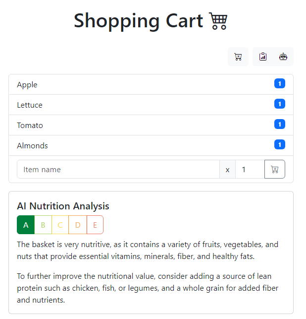
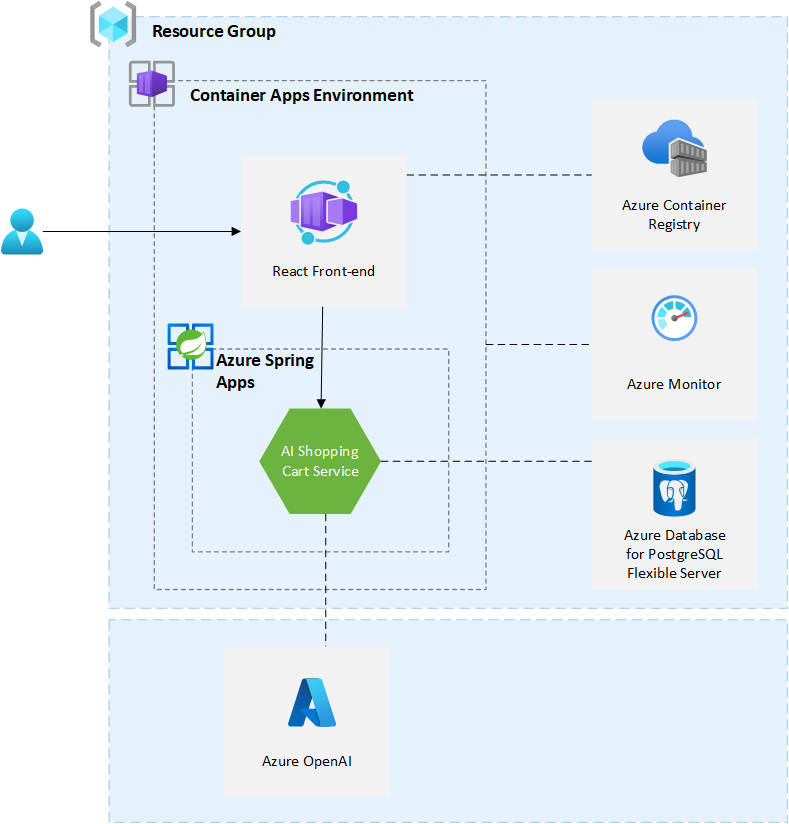

# AI Shopping Cart - App Template for Java, Azure OpenAI and Azure Spring Apps

[](https://codespaces.new/Azure-Samples/app-templates-java-openai-springapps)
[](https://vscode.dev/redirect?url=vscode://ms-vscode-remote.remote-containers/cloneInVolume?url=https://github.com/Azure-Samples/app-templates-java-openai-springapps)

AI Shopping Cart is a sample application that supercharges your shopping experience with the power of AI. It leverages Azure OpenAI and Azure Spring Apps to build a recommendation engine that is not only scalable, resilient, and secure, but also personalized to your needs. Taking advantage of Azure OpenAI, the application performs nutrition analysis on the items in your cart and generates the top 3 recipes using those ingredients. With Azure Developer CLI (azd), you’re just a few commands away from having this fully functional sample application up and running in Azure. Let's get started!

> This sample application take inspiration on this original work: https://github.com/lopezleandro03/ai-assisted-groceries-cart

> Refer to the [App Templates](https://github.com/microsoft/App-Templates) repository Readme for more samples that are compatible with [`azd`](https://github.com/Azure/azure-dev/).



## Pre-requisites

- [Install the Azure Developer CLI](https://learn.microsoft.com/en-us/azure/developer/azure-developer-cli/install-azd)
- An Azure account with an active subscription. [Create one for free](https://azure.microsoft.com/free).
- [OpenJDK 17](https://learn.microsoft.com/en-us/java/openjdk/install)
- [Node.js 20.5.0+](https://nodejs.org/en/download/)
- [Docker](https://docs.docker.com/get-docker/)
- [Azure OpenAI with `gpt-4` or `gpt-35-turbo`](https://learn.microsoft.com/en-us/azure/ai-services/openai/overview#how-do-i-get-access-to-azure-openai) <sup>[\[Note\]](#azure-openai)</sup>
- Review the [architecture diagram and the resources](#application-architecture) you'll deploy and the [Azure OpenAI](#azure-openai) section.

## Quickstart

To learn how to get started with any template, follow [this quickstart](https://learn.microsoft.com/en-us/azure/developer/azure-developer-cli/get-started?tabs=localinstall&pivots=programming-language-java). For this template `Azure-Samples/app-templates-java-openai-springapps`, you need to execute a few additional steps as described below.

This quickstart will show you how to authenticate on Azure, enable Spring Apps [alpha feature](https://learn.microsoft.com/en-us/azure/developer/azure-developer-cli/feature-versioning#alpha-features) for azd, initialize using a template, set the [environment variables](https://learn.microsoft.com/en-us/azure/developer/azure-developer-cli/manage-environment-variables) for Azure OpenAI, provision the infrastructure, and deploy the code to Azure:

```bash
# Log in to azd if you haven't already
azd auth login

# Enable Azure Spring Apps alpha feature for azd
azd config set alpha.springapp on

# First-time project setup. Initialize a project in the current directory using this template
azd init --template Azure-Samples/app-templates-java-openai-springapps

# Set the environment variables for Azure OpenAI
azd env set azureOpenAiApiKey <replace-with-Azure-OpenAi-API-key> 
azd env set azureOpenAiEndpoint <replace-with-Azure-OpenAi-endpoint>
azd env set azureOpenAiDeploymentId <replace-with-Azure-OpenAi-deployment-id/name>

# To use GPT-3.5 Turbo model set this environment variable to false
azd env set isAzureOpenAiGpt4Model true

# Provision and deploy to Azure
azd up
```

> Notes
> * Replace the placeholders with the values from your Azure OpenAI resource.
> * If you are using `gpt-35-turbo` model, you need to set `isAzureOpenAiGpt4Model` to `false` before provisioning the resource and deploying the sample application to Azure:
>     ```bash
>     azd env set isAzureOpenAiGpt4Model false
>     ```

At the end of the deployment, you will see the URL of the front-end. Open the URL in a browser to see the application in action.

## Application Architecture

This sample application uses the following Azure resources:

- [Azure Container Apps (Environment)](https://learn.microsoft.com/en-us/azure/container-apps/) to host the frontend as a Container App and Azure Spring Apps [Standard comsumption and dedicated plan](https://learn.microsoft.com/en-us/azure/spring-apps/overview#standard-consumption-and-dedicated-plan)
- [Azure Spring Apps](https://learn.microsoft.com/azure/spring-apps/) to host the AI Shopping Cart Service as a Spring App
- [Azure Container Registry](https://learn.microsoft.com/azure/container-registry/) to host the Docker image for the frontend
- [Azure Database for PostgreSQL (Flexible Server)](https://learn.microsoft.com/azure/postgresql/) to store the data for the AI Shopping Cart Service
- [Azure Monitor](https://learn.microsoft.com/en-us/azure/azure-monitor/) for monitoring and logging
- [Azure OpenAI](https://learn.microsoft.com/en-us/azure/ai-services/openai/) to perform nutrition analysis and generate top 3 recipes. It is not deployed with the sample app<sup>[\[Note\]](#azure-openai)</sup>.

Here's a high level architecture diagram that illustrates these components. Excepted Azure OpenAI, all the other resources are provisioned in a single [resource group](https://learn.microsoft.com/en-us/azure/azure-resource-manager/management/manage-resource-groups-portal) that is created when you create your resources using `azd up`.



> This template provisions resources to an Azure subscription that you will select upon provisioning them. Please refer to the [Pricing calculator for Microsoft Azure](https://azure.microsoft.com/pricing/calculator/) and, if needed, update the included Azure resource definitions found in `infra/main.bicep` to suit your needs.

## Azure OpenAI

This sample application uses Azure OpenAI. It is not part of the automated deployment process. You will need to create an Azure OpenAI resource and configure the application to use it. Please follow the instructions in the [Azure OpenAI documentation](https://learn.microsoft.com/en-us/azure/ai-services/openai/overview#how-do-i-get-access-to-azure-openai) to get access to Azure OpenAI. Do not forget to read the [overview of the Responsible AI practices for Azure OpenAI models](https://learn.microsoft.com/en-us/legal/cognitive-services/openai/overview?context=%2Fazure%2Fai-services%2Fopenai%2Fcontext%2Fcontext) before you start using Azure OpenAI and request access.

The current version of the sample app requires a publicly accessible Azure OpenAI resource (i.e. Allow access from all networks). This sample is not intended to be used in production. To know more about networking and security for Azure OpenAI, please refer to the [Azure OpenAI documentation](#azure-spring-apps-consumption---networking-and-security).

This sample app was developed to be used with `gpt-4` model. It also supports `gpt-35-turbo`. To use `gpt-35-turbo`, you need to set `isAzureOpenAiGpt4Model` to `false` (cf. [Quickstart](#quickstart)). By default, this parameter/environment variable is set to `true`. To complete the setup of the application, you need to set the following information from the Azure OpenAI resource:

- `azureOpenAiApiKey` - Azure OpenAI API key
- `azureOpenAiEndpoint` - Azure OpenAI endpoint
- `azureOpenAiDeploymentId` - Azure OpenAI deployment ID of `gpt-4` or `gpt-3.5-turbo` model

The API key and the endpoint can be found in the Azure Portal. You can follow these instructions: [Retrieve key and enpoint](https://learn.microsoft.com/en-us/azure/ai-services/openai/quickstart?tabs=command-line&pivots=programming-language-java#retrieve-key-and-endpoint). The deployment id corresponds to the `deployment name` in [this guide](https://learn.microsoft.com/en-us/azure/ai-services/openai/how-to/create-resource?pivots=web-portal#deploy-a-model).

[Prompt engineering](https://learn.microsoft.com/en-us/azure/ai-services/openai/concepts/prompt-engineering) is important to get the best results from Azure OpenAI. Text prompts are how users interact with GPT models. As with all generative large language model (LLM), GPT models try to produce the next series of words that are the most likely to follow the previous text. It is a bit like asking to the AI model: What is the first thing that comes to mind when I say `<prompt>`?

With the [Chat Completion API](https://learn.microsoft.com/en-us/azure/ai-services/openai/how-to/chatgpt?pivots=programming-language-chat-completions), there are distinct sections of the prompt that are sent to the API associated with a specific role: system, user and assitant. The system message is included at the begining of the prompt and is used to provides the initial instructions to the model: description of the assitant, personality traits, instructions/rules it will follow, etc.

`AI Shopping Cart Service` is using [Azure OpenAI client library for Java](https://learn.microsoft.com/en-us/java/api/overview/azure/ai-openai-readme). This libary is part of of [Azure SDK for Java](https://learn.microsoft.com/en-us/azure/developer/java/sdk/). It is implemented as a [chat completion](https://learn.microsoft.com/en-us/java/api/overview/azure/ai-openai-readme?view=azure-java-preview#chat-completions). In the service, we have 2 system messages in [SystemMessageConstants.java](src/ai-shopping-cart-service/src/main/java/com/microsoft/azure/samples/aishoppingcartservice/openai/SystemMessageConstants.java): one for AI Nutrition Analysis and one to generate top 3 recipes. The system message is followed by a user message: `The basket is: <list of items in the basket separated by a comma>`. The assistant message is the response from the model. The service is using the [ShoppingCartAiRecommendations](src/ai-shopping-cart-service/src/main/java/com/microsoft/azure/samples/aishoppingcartservice/openai/ShoppingCartAiRecommendations.java) to interact with Azure OpenAI. In this class you will find the code that is responsible for generating the prompt and calling the Azure OpenAI API: `getChatCompletion`. To know more about temperature and topP used in this class, please refer to [the documentation](https://learn.microsoft.com/en-us/azure/ai-services/openai/concepts/advanced-prompt-engineering?pivots=programming-language-chat-completions#temperature-and-top_p-parameters).

For `gpt-35-turbo` model, more context is added to the user message. This additional context is added at the end of the user message. It provides more information on the format of the JSON that OpenAI model needs to return and ask the model tor return only the JSON without additional text. This additional context is available in [UserMessageConstants.java](src/ai-shopping-cart-service/src/main/java/com/microsoft/azure/samples/aishoppingcartservice/openai/UserMessageConstants.java).

- [Pre-requisites](#pre-requisites) :arrow_heading_up:
- [Application Architecture](#application-architecture) :arrow_heading_up:

## Application Code

This template is structured to follow the [Azure Developer CLI template convetions](https://learn.microsoft.com/en-us/azure/developer/azure-developer-cli/make-azd-compatible?pivots=azd-create#azd-conventions). You can learn more about `azd` architecture in [the official documentation](https://learn.microsoft.com/azure/developer/azure-developer-cli/make-azd-compatible?pivots=azd-create#understand-the-azd-architecture).

## Next Steps

At this point, you have a complete application deployed on Azure. 

### Enterprise Scenarios

For enterprise needs, looking for polyglot applications deployment, Tanzu components support and SLA assurance, we recommend to use [Azure Spring Apps Enterprise](https://learn.microsoft.com/en-us/azure/spring-apps/overview#enterprise-plan). Check the [Azure Spring Apps landing zone accelerator](https://github.com/Azure/azure-spring-apps-landing-zone-accelerator) that provides architectural guidance designed to streamline the production ready infrastructure provisioning and deployment of Spring Boot and Spring Cloud applications to Azure Spring Apps. As the workload owner, use [architectural guidance](https://learn.microsoft.com/en-us/azure/cloud-adoption-framework/scenarios/app-platform/spring-apps/landing-zone-accelerator) provided in landing zone accelerator to achieve your target technical state with confidence.

### Azure Developer CLI

You have deployed the sample application using Azure Developer CLI, however there is much more that the Azure Developer CLI can do. These next steps will introduce you to additional commands that will make creating applications on Azure much easier. Using the Azure Developer CLI, you can setup your pipelines, monitor your application, test and debug locally.

- [`azd down`](https://learn.microsoft.com/azure/developer/azure-developer-cli/reference#azd-down) - to delete all the Azure resources created with this template 

- [`azd pipeline config`](https://learn.microsoft.com/azure/developer/azure-developer-cli/configure-devops-pipeline?tabs=GitHub) - to configure a CI/CD pipeline (using GitHub Actions or Azure DevOps) to deploy your application whenever code is pushed to the main branch.
  - Several environment variables / secrets need to be set for Azure OpenAI resource:
    - `AZURE_OPENAI_API_KEY`: API key for Azure OpenAI resource
      - For GitHub workflows, you should use [GitHub Secrets](https://docs.github.com/en/actions/reference/encrypted-secrets)
      - For Azure DevOps pipelines, you check 'Keep this value secret' when creating the variable
    - `AZURE_OPENAI_ENDPOINT`: Endpoint for Azure OpenAI resource
    - `AZURE_OPENAI_DEPLOYMENT_ID`: Deployment ID/name for Azure OpenAI resource
    - `IS_AZURE_OPENAI_GPT4_MODEL`: Set to `true` if you are using GPT-4 model and to `false` if you are using GPT-3.5 Turbo model

- [`azd monitor`](https://learn.microsoft.com/azure/developer/azure-developer-cli/monitor-your-app) - to monitor the application and quickly navigate to the various Application Insights dashboards (e.g. overview, live metrics, logs)

- [Run and Debug Locally](https://learn.microsoft.com/azure/developer/azure-developer-cli/debug?pivots=ide-vs-code) - using Visual Studio Code and the Azure Developer CLI extension

### Additional `azd` commands

The Azure Developer CLI includes many other commands to help with your Azure development experience. You can view these commands at the terminal by running `azd help`. You can also view the full list of commands on our [Azure Developer CLI command](https://aka.ms/azure-dev/ref) page.

## Resources

These are additional resources that you can use to learn more about the sample application and its underlying technologies.

- [Start from zero and scale to zero – Azure Spring Apps consumption plan](https://techcommunity.microsoft.com/t5/apps-on-azure-blog/start-from-zero-and-scale-to-zero-azure-spring-apps-consumption/ba-p/3774825)

### Azure Spring Apps Consumption - Networking and Security

- [https://learn.microsoft.com/en-us/azure/ai-services/openai/encrypt-data-at-rest](https://learn.microsoft.com/en-us/azure/ai-services/cognitive-services-virtual-networks?context=%2Fazure%2Fai-services%2Fopenai%2Fcontext%2Fcontext&tabs=portal)
- [https://learn.microsoft.com/en-us/azure/ai-services/openai/encrypt-data-at-rest](https://learn.microsoft.com/en-us/azure/ai-services/openai/encrypt-data-at-rest)
- [How to configure Azure OpenAI Service with managed identities](https://learn.microsoft.com/en-us/azure/ai-services/openai/how-to/managed-identity)

## Data Collection
The software may collect information about you and your use of the software and send it to Microsoft. Microsoft may use this information to provide services and improve our products and services. You may turn off the telemetry as described in the repository. There are also some features in the software that may enable you and Microsoft to collect data from users of your applications. If you use these features, you must comply with applicable law, including providing appropriate notices to users of your applications together with a copy of Microsoft's privacy statement. Our privacy statement is located at https://go.microsoft.com/fwlink/?LinkId=521839. You can learn more about data collection and use in the help documentation and our privacy statement. Your use of the software operates as your consent to these practices.

## Telemetry Configuration
Telemetry collection is on by default.

To opt-out, set the variable enableTelemetry to false in `infra/main.parameters.json` or in bicep template `infra/main.bicep`. It can be set using the following command when the provisionning is done with Azure Developer CLI:

```bash
azd env set enableTelemetry false
```

## Trademarks

This project may contain trademarks or logos for projects, products, or services. Authorized use of Microsoft 
trademarks or logos is subject to and must follow 
[Microsoft's Trademark & Brand Guidelines](https://www.microsoft.com/en-us/legal/intellectualproperty/trademarks/usage/general).
Use of Microsoft trademarks or logos in modified versions of this project must not cause confusion or imply Microsoft sponsorship.
Any use of third-party trademarks or logos are subject to those third-party's policies.
